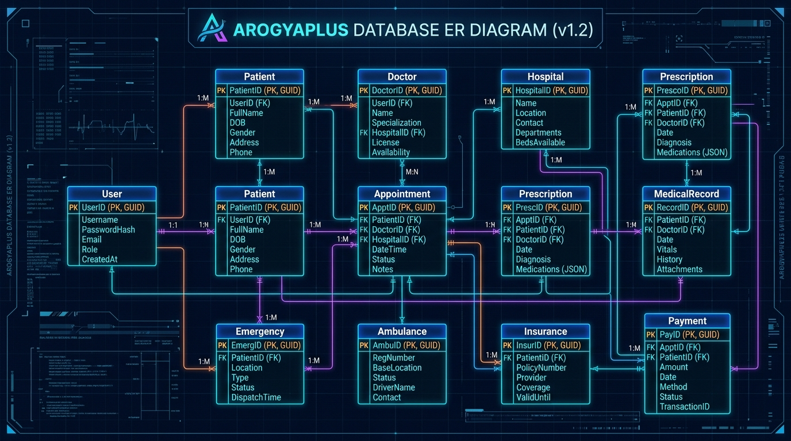

# 🗄️ ArogyaPlus - Database Entity-Relationship (ER) Diagram & Schema Blueprint

> **ArogyaPlus (Smart Health Management System)**  
> Comprehensive database design, relational cardinalities, foreign key references, indexes, and schema definitions.

---

## 🖼️ Database ER Diagram Architectural Blueprint

---

## 1. Complete Entity-Relationship (ER) Diagram

```mermaid
erDiagram
    USER ||--o{ APPOINTMENT : "patient books"
    USER ||--o{ APPOINTMENT : "doctor attends"
    USER ||--o{ EMERGENCY : "creates"
    USER ||--o{ EMERGENCY : "doctor assigned"
    USER ||--o{ AMBULANCE : "requests"
    USER ||--o{ AMBULANCE : "doctor assigned"
    USER ||--o{ PRESCRIPTION : "prescribed to (patient)"
    USER ||--o{ PRESCRIPTION : "written by (doctor)"
    USER ||--o{ MEDICAL_RECORD : "belongs to"
    USER ||--o{ INSURANCE : "claims submitted by"
    USER ||--o{ PAYMENT : "paid by"
    USER ||--o{ PUSH_SUBSCRIPTION : "registers device for"
    USER ||--o{ AMBULANCE_FLEET : "created / managed by admin"
    USER ||--o{ USER : "created by admin (staff)"

    AMBULANCE_FLEET ||--o{ AMBULANCE : "assigned to trip"
    APPOINTMENT ||--o{ PAYMENT : "billed for"
    HOSPITAL ||--o{ AMBULANCE_FLEET : "stationed at"

    USER {
        ObjectId _id PK
        string name
        string email UK "unique, indexed"
        string password "bcrypt hashed"
        string phone
        string role "patient | doctor | admin | super-admin"
        string hospitalName
        string hospitalAddress
        object hospitalCoordinates "lat, lng"
        string department
        string accessLevel "full | operations | limited | receptionist"
        string specialization
        string clinicAddress
        object clinicCoordinates "lat, lng"
        ObjectId createdByAdmin FK "ref: User"
        boolean isActive "default: true"
        boolean isTerminated "default: false"
        number rating "0 to 5.0"
        number reviewCount
        string qualification
        number experienceYears
        array passkeys "WebAuthn / Passkeys"
        boolean mfaEnabled
        boolean totpVerified
        string totpSecret
        date createdAt
        date updatedAt
    }

    APPOINTMENT {
        ObjectId _id PK
        ObjectId patient FK "ref: User, required"
        ObjectId doctor FK "ref: User, required"
        date appointmentDate "required"
        string reason "required"
        string consultationType "in_person | video"
        string status "pending | confirmed | completed | cancelled"
        string tokenNumber UK "unique token code"
        string notes
        number doctorRating "1 to 5"
        string doctorReview
        date ratedAt
        date createdAt
        date updatedAt
    }

    EMERGENCY {
        ObjectId _id PK
        string patientName "required"
        string contact "required"
        array symptoms "list of symptom strings"
        string priority "low | medium | high | critical"
        string status "waiting | in_progress | resolved"
        string location "required"
        number latitude "default: 28.6139"
        number longitude "default: 77.2090"
        ObjectId assignedDoctor FK "ref: User"
        ObjectId createdBy FK "ref: User, required"
        date createdAt
        date updatedAt
    }

    AMBULANCE {
        ObjectId _id PK
        ObjectId requestedBy FK "ref: User, required"
        string pickupLocation "required"
        string problemDescription
        object pickupCoordinates "lat, lng"
        string hospitalLocation "required"
        string hospitalName
        object hospitalCoordinates "lat, lng"
        ObjectId assignedDoctor FK "ref: User"
        string assignedDoctorName
        string assignedDoctorSpecialization
        string doctorAvailabilityStatus "free | busy | unassigned"
        ObjectId assignedAmbulance FK "ref: AmbulanceFleet"
        string assignedAmbulanceVehicleNumber
        object ambulanceCoordinates "lat, lng"
        string status "requested | dispatched | arrived | completed | cancelled"
        string driverName
        string vehicleNumber
        number etaMinutes
        date lastLocationUpdatedAt
        date createdAt
        date updatedAt
    }

    AMBULANCE_FLEET {
        ObjectId _id PK
        string hospitalName "required"
        string hospitalAddress
        object hospitalCoordinates "lat, lng"
        string vehicleNumber UK "unique, uppercase"
        string driverName
        string driverPhone
        string driverEmail
        string equipmentLevel "ALS | BLS | Patient Transport | ICU Ambulance"
        string status "available | dispatched | maintenance | inactive"
        number speed
        object currentCoordinates "lat, lng"
        date lastAssignedAt
        string notes
        ObjectId createdByAdmin FK "ref: User"
        ObjectId updatedByAdmin FK "ref: User"
        date createdAt
        date updatedAt
    }

    HOSPITAL {
        ObjectId _id PK
        string name UK "required, indexed"
        number latitude "required, indexed"
        number longitude "required, indexed"
        string address "required"
        string specialty "default: General Healthcare"
        string phone
        number availableBeds "default: 10"
        boolean emergencyServices "default: true"
        date createdAt
        date updatedAt
    }

    PRESCRIPTION {
        ObjectId _id PK
        ObjectId patient FK "ref: User, required"
        ObjectId doctor FK "ref: User"
        string medicineName "required"
        string dosage
        string frequency
        string instructions
        string status "active | completed | discontinued"
        date nextRefillDate
        date lastRefillRequestedAt
        number refillRequestCount
        date createdAt
        date updatedAt
    }

    MEDICAL_RECORD {
        ObjectId _id PK
        ObjectId patient FK "ref: User, required"
        string title "required"
        string recordType "default: General"
        date recordDate "default: Date.now"
        string notes
        string documentUrl
        date createdAt
        date updatedAt
    }

    INSURANCE {
        ObjectId _id PK
        ObjectId user FK "ref: User, required"
        string providerName "required"
        string policyNumber "required"
        number claimAmount "required"
        string claimReason "required"
        array documents "URLs of uploaded claims"
        string status "submitted | under_review | approved | rejected"
        string adminRemark
        date createdAt
        date updatedAt
    }

    PAYMENT {
        ObjectId _id PK
        ObjectId user FK "ref: User, required"
        ObjectId appointment FK "ref: Appointment"
        number amount "required"
        string currency "default: INR"
        string razorpayOrderId "required"
        string razorpayPaymentId
        string razorpaySignature
        string status "created | verified | failed"
        string method
        date createdAt
        date updatedAt
    }

    PUSH_SUBSCRIPTION {
        ObjectId _id PK
        ObjectId user FK "ref: User, required"
        string endpoint "required, unique"
        object keys "p256dh, auth"
        string userAgent
        date createdAt
        date updatedAt
    }

    SYSTEM_SETTINGS {
        ObjectId _id PK
        string hospitalName
        string contactEmail
        string emergencyPhone
        boolean allowPatientRegistration
        boolean enableWebPush
        boolean enableSmsFallback
        number maxConcurrentEmergencies
        date updatedAt
    }
```

---

## 2. Relational Summary Table

| Relationship | Cardinality | Parent Entity | Child Entity | Foreign Key Field | Description |
| :--- | :---: | :--- | :--- | :--- | :--- |
| **Patient Appointments** | `1 : N` | `User (patient)` | `Appointment` | `patient` | A patient can book multiple appointments over time. |
| **Doctor Appointments** | `1 : N` | `User (doctor)` | `Appointment` | `doctor` | A doctor manages multiple patient consultations. |
| **Patient Emergency SOS** | `1 : N` | `User (patient)` | `Emergency` | `createdBy` | A user can trigger emergency SOS incidents. |
| **Doctor Emergency Assignment**| `1 : N` | `User (doctor)` | `Emergency` | `assignedDoctor` | Doctors are assigned to treat triage emergencies. |
| **Patient Ambulance Booking** | `1 : N` | `User (patient)` | `Ambulance` | `requestedBy` | A user requests emergency or non-emergency ambulance. |
| **Fleet Trip Assignment** | `1 : N` | `AmbulanceFleet`| `Ambulance` | `assignedAmbulance` | Vehicles in the fleet are dispatched for trips. |
| **Patient Prescriptions** | `1 : N` | `User (patient)` | `Prescription` | `patient` | Patient active and historical medication records. |
| **Doctor Prescriptions** | `1 : N` | `User (doctor)` | `Prescription` | `doctor` | Doctor who authorized the prescription. |
| **Patient EHR Records** | `1 : N` | `User (patient)` | `MedicalRecord`| `patient` | Health history, diagnostics, lab records. |
| **Insurance Claims** | `1 : N` | `User (patient)` | `Insurance` | `user` | Patient reimbursement claims with policy number. |
| **Clinical Payments** | `1 : N` | `User (patient)` | `Payment` | `user` | Razorpay transactions and consultation fees. |
| **Appointment Payment** | `1 : 1 / 1 : N` | `Appointment` | `Payment` | `appointment` | Links specific consultation to billing order. |
| **Staff Hierarchy** | `1 : N` | `User (admin)` | `User (staff)` | `createdByAdmin` | Admins create and manage doctor & receptionist accounts. |
