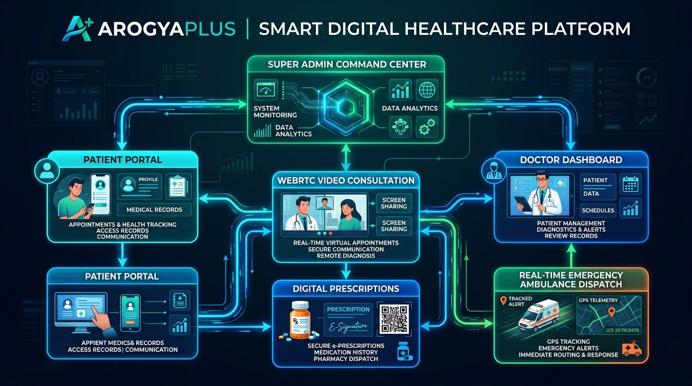
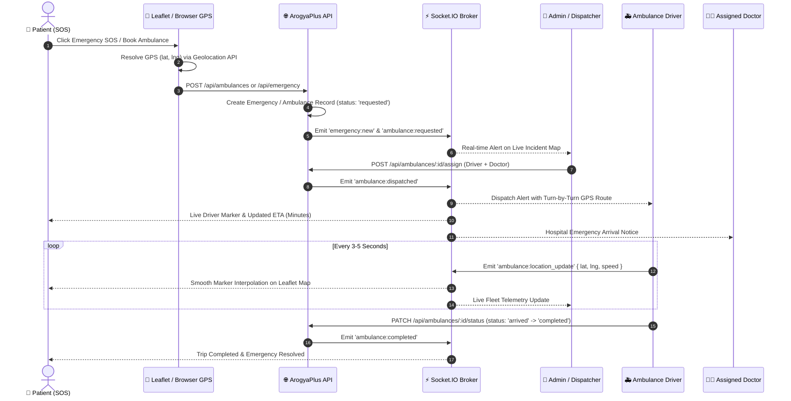
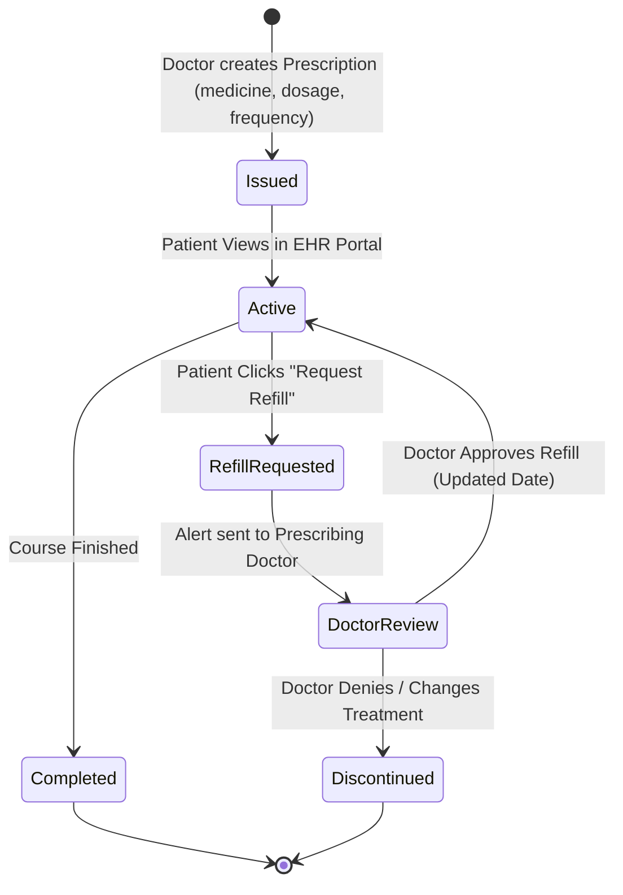
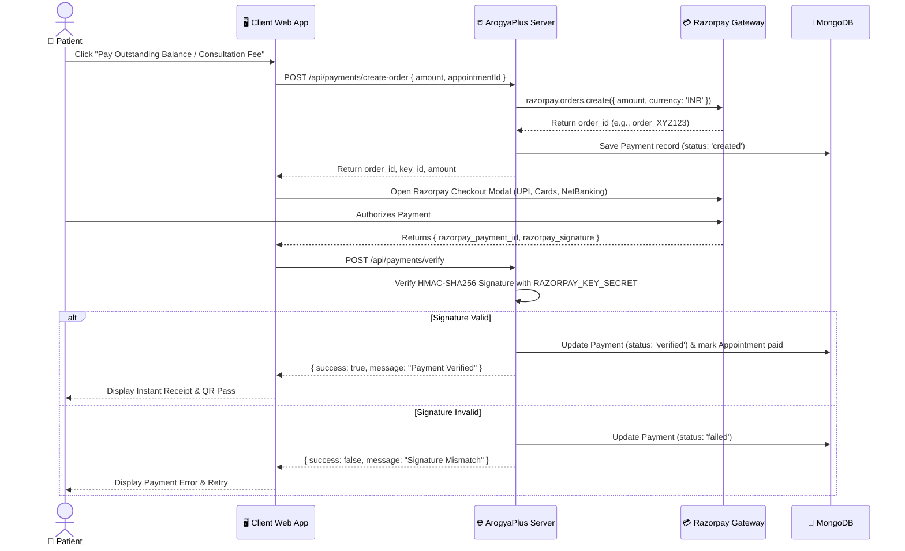

# 🏥 ArogyaPlus - System Architecture & Workflows Flowchart

> **ArogyaPlus (Smart Health Management System)**  
> Complete operational workflows, user roles, real-time telemetry, and service interaction flowcharts.

---

## 🖼️ System High-Level Architecture Infographic

---

## 1. End-to-End System Role & Module Flowchart

```mermaid
flowchart TD
    %% Roles
    PatientUser(["🧑 Patient / User"]):::patient
    DoctorUser(["👨‍⚕️ Doctor / Medical Staff"]):::doctor
    AdminUser(["🏢 Hospital Admin"]):::admin
    SuperAdminUser(["⚡ Super Admin"]):::superadmin

    %% Gateway & Auth
    Gateway["🌐 Express.js API Gateway & Static Server (PWA)"]:::backend
    JWTGuard{"🔐 JWT Auth & Role Authorization"}:::security

    PatientUser -->|Register / Login| Gateway
    DoctorUser -->|Login| Gateway
    AdminUser -->|Login| Gateway
    SuperAdminUser -->|MFA / Passkey Login| Gateway

    Gateway --> JWTGuard

    %% Patient Portal Flows
    JWTGuard -->|role: patient| PatientPortal["🧑 Patient Portal"]
    PatientPortal --> BookAppt["📅 Book Appointments (In-Person / Video)"]
    PatientPortal --> EmergencySOS["🚨 Trigger Emergency SOS (GPS Auto-Locate)"]
    PatientPortal --> AmbTrack["🚑 Real-Time Ambulance Booking & Live GPS Tracking"]
    PatientPortal --> WebRTCVideo["📹 WebRTC Telemedicine Consultation"]
    PatientPortal --> PrescriptionView["💊 Digital Prescriptions & Refill Requests"]
    PatientPortal --> InsuranceClaim["📄 Submit & Track Insurance Claims"]
    PatientPortal --> PayBill["💳 Razorpay Payment & Invoicing Pass"]
    PatientPortal --> AIChat["🤖 AI Health Assistant & Symptom Triage"]

    %% Doctor Portal Flows
    JWTGuard -->|role: doctor| DoctorPortal["👨‍⚕️ Doctor Clinical Dashboard"]
    DoctorPortal --> DocQueue["📋 Manage Patient Queue & Schedule"]
    DoctorPortal --> DocVideo["📹 Host WebRTC Consultation Room"]
    DoctorPortal --> DocEHR["✍️ Issue Digital Prescriptions & Diagnostic Notes"]
    DoctorPortal --> DocReviews["⭐ View Patient Ratings & Feedbacks"]

    %% Admin Portal Flows
    JWTGuard -->|role: admin| AdminPortal["🏢 Hospital Branch Admin"]
    AdminPortal --> ManageDocs["🩺 Onboard / Terminate Doctors & Set Specialties"]
    AdminPortal --> AmbDispatch["🚑 Ambulance Fleet Dispatch & Driver Management"]
    AdminPortal --> EmergencyQueue["🚨 Active Emergency Incident Response"]
    AdminPortal --> StorageMgr["📁 Clinical File & Attachment Storage Manager"]
    AdminPortal --> AdminReports["📊 Billing & Operational Analytics"]

    %% Super Admin Flows
    JWTGuard -->|role: superadmin| SuperPortal["⚡ Super Admin Command Center"]
    SuperPortal --> GlobalTelemetry["📡 Live Socket.IO Telemetry & GPS Heatmap"]
    SuperPortal --> AuditLogs["📜 System Audit Logs & Security Traces"]
    SuperPortal --> HospitalBranches["🏥 Multi-Hospital Branch Infrastructure"]
    SuperPortal --> GlobalSettings["⚙️ Platform Rate Limits & Notification VAPID Config"]

    %% Real-time Engine
    AmbTrack <-->|Socket.IO Events| SocketServer["⚡ Socket.IO Real-time Engine"]:::realtime
    EmergencySOS <-->|Socket.IO Events| SocketServer
    GlobalTelemetry <-->|Live Stream| SocketServer
    WebRTCVideo <-->|STUN/TURN WebRTC Signaling| SocketServer

    %% Database
    Gateway --> MongoCluster[("🍃 MongoDB Database")]:::database

    classDef patient fill:#0ea5e9,stroke:#0284c7,stroke-width:2px,color:#fff;
    classDef doctor fill:#10b981,stroke:#059669,stroke-width:2px,color:#fff;
    classDef admin fill:#f59e0b,stroke:#d97706,stroke-width:2px,color:#fff;
    classDef superadmin fill:#8b5cf6,stroke:#7c3aed,stroke-width:2px,color:#fff;
    classDef backend fill:#1e293b,stroke:#3b82f6,stroke-width:2px,color:#fff;
    classDef security fill:#ef4444,stroke:#dc2626,stroke-width:2px,color:#fff;
    classDef realtime fill:#06b6d4,stroke:#0891b2,stroke-width:2px,color:#fff;
    classDef database fill:#047857,stroke:#065f46,stroke-width:2px,color:#fff;
```

---

## 2. Real-Time Emergency Ambulance SOS & Dispatch Flow

---

## 3. Appointment Booking, QR Pass & Telemedicine Video Flow

```mermaid
flowchart LR
    subgraph Booking [1. Booking & Scheduling]
        A[User opens Find Doctors] --> B[Sorts by Distance / Specialty]
        B --> C[Selects Date & Consultation Type: In-Person / Video]
        C --> D[Submits Booking POST /api/appointments]
        D --> E[Generates Unique Token & QR Check-in Pass]
    end

    subgraph InPerson [2. In-Person Flow]
        E -->|In-Person| F[Arrives at Hospital]
        F --> G[Admin Scans QR Pass for Instant Check-in]
        G --> H[Doctor Consultation & Digital EHR]
    end

    subgraph Telemedicine [3. Video Consultation Flow]
        E -->|Video| I[Receives Video Room Key & Link]
        I --> J[Patient & Doctor Join /user/video-consultation]
        J --> K[WebRTC Peer Connection via STUN/TURN Traversal]
        K --> L[High-Definition Two-Way Audio/Video & Chat]
    end

    subgraph Completion [4. Prescription & Review]
        H --> M[Doctor Submits Prescription & Medical Advice]
        L --> M
        M --> N[Patient Receives WebPush Notification]
        N --> O[Patient Rates Doctor 1-5 Stars with Feedback]
    end
```

---

## 4. Digital Prescription, Medicine Refill & EHR Flow

---

## 5. Razorpay Clinical Payment & Webhook Verification Flow

